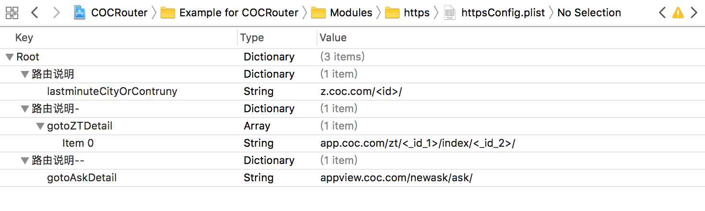

## COCRouter
借鉴ASP.NET MVC[约定优于配置](http://zh.wikipedia.org/wiki/%E7%BA%A6%E5%AE%9A%E4%BC%98%E4%BA%8E%E9%85%8D%E7%BD%AE)设计思路, 实现iOS 路由器到模块控制器零耦合调用

## 实现
根据Url 

- 自定义的 
-  服务器下发的 
-  AppScheme 如： cocer://soming/12/ 

经过统一路由组件COCRouter  分发到 ModuleController or 导航ViewController ，包含错误处理机制。

## 应用场景

- 统一解析 WebView / 推送 解析Https 、 App Scheme  等服务器下方的url。并转发到 (UrlScheme)Controller 中处理。【需要配置文件 SEL 和 Url 的映射关系】

	     [COCRouter forwardModule:[NSURL URLWithString:url] complete:^(COCRouterMode mode) {
	        if (mode == COCRouterModeSuccess) {
	            //TODO
	        }
	    }];

- 转发业务/UI 模块。实现自定义参数，创建路由器的扩展  如：【不需要配置文件，根据convention: 实现约定SEL】
   

		static NSString *const OrderDetailRoute = @"order://detail/";
		
		@implementation COCRouter (Order)
		
		+ (void)orderDetail:(NSString *)discountID
		             baseVC:(UIViewController *)vc
		         paySuccess:(void (^)( NSDictionary *info))successBlock
		          payCancel:(void (^)(NSDictionary *info))cancelBlock{
		    
		    [COCRouter forwardModule:[NSURL URLWithString:OrderDetailRoute]
		                 convention:_cmd
		                       args:@[discountID,vc,successBlock,cancelBlock]
		               complete:nil];
		}
		
- 导航ViewController 

	    #import "COCRouter+Navigation.h"
	    
        //注册一条路由
	    _RouteMap(@"navigator://user/<_id>/", [UserInfoViewController class]);
	    
	    [COCRouter push:[NSURL URLWithString:@"navigator://user/1101/"] animated:YES];

- 错误处理 : 每条路由转发都可以自定义 complete 回调，也可以注册全局的错误处理器，并实现 COCRoutingFilterProtocol 
    
        [COCRouter registerFilterClass:[RouteFilterHandler class]];

## 以上功能默认约定：

- 模块控制器命名：UrlScheme + Controller 。如HttpsController、OrderController。
- 模块路由配置文件【可选，参见上面应用场景】：UrlScheme + Config 。 如HttpsConfig、OrderConfig。

  
  
  如图 Key： 路由说明, Value ：{ SEL : Url } ，此图原Url 为https://z.cocer.com/123/ 。 使用
  
			            <customName> 占位
  
  以customName 为key 获取参数Value
  
  SEL 即HttpsController 中对应Url 的处理方法SEL
 
  支持 SEL:URL 一对多关系 ,配置文件中  value 可选为{ SEL : @[ Url1,Url2,Url3  ] } 
  
- 模块控制器接收路由数据：按需声明唯一的NSDictionary属性，随意命名，NSDictionary 可与 COCRoutingContext 互转。

        @interface HttpsController : NSObject
        @property (strong, nonatomic) NSDictionary* context;        
        
## 测试

   组件发布前必须通过测试
  
   组件在代码实现上对 COCRouter 没有任何依赖，但组件的测试Target 可以依赖COCRouter 封装的ModuleTestCase 测试逻辑，只需传入组件名。如：
  
        [[ModuleTestCase alloc] initModuleTestWithScheme:@"https"];

  包含检查 组件是否遵守上述约定、尝试转发所有配置的url、转发随机url,重复10次的性能报告。

  查看COCRouter 的 Tests.m 实现。
 
